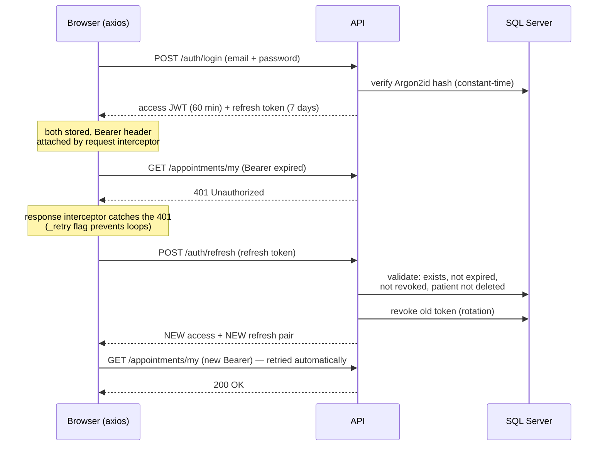
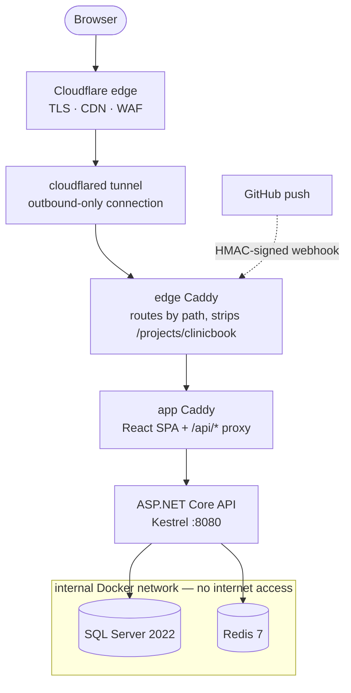

# ClinicBook — Clinic Appointment Booking System


**Live demo: [app.matshaugum.com/projects/clinicbook](https://app.matshaugum.com/projects/clinicbook)** — self-hosted on my own hardware behind a Cloudflare Tunnel. The database resets itself to a clean seeded state every hour, so feel free to book, register, and explore.

ClinicBook is a full-stack appointment booking system for a group of medical clinics. Patients can book as a guest with no account, or register to view, reschedule, and cancel their bookings; an admin panel manages doctors, clinics, specialities, and categories. It started as a school back-end project and grew into a production deployment: integration-tested over real HTTP and SQL Server, containerized, auto-deployed on every push, and served from a home server with **zero open inbound ports**.

---

## Screenshots

<!-- Drop PNGs into docs/screenshots/ with these filenames and they will appear automatically. -->

| Booking with live availability | Doctor search |
|---|---|
|  |  |

| Patient dashboard | Admin dashboard |
|---|---|
|  |  |

---

## What makes this more than a CRUD app

### Security-focused authentication
Passwords are hashed with **Argon2id** (64 MB memory cost, 3 iterations, per-user random salt) and verified with a constant-time comparison — see [`AuthService.cs`](Backend/ClinicAppointmentBookingSystem/Services/Auth/AuthService.cs). Sessions use short-lived JWTs plus **refresh-token rotation** — the full token lifecycle is diagrammed in [Authentication flow](#authentication-flow-jwt--refresh-token-rotation) below. Login and registration sit behind a tight 5 requests/minute rate limit.

### Guest → registered account upgrade
Guests book appointments with no account. If they later register with the same email, the existing guest row is **upgraded in place** rather than duplicated — the patient ID stays stable, so every appointment they booked as a guest instantly belongs to their new account. No orphaned data, no manual migration. See [`AuthService.RegisterAsync`](Backend/ClinicAppointmentBookingSystem/Services/Auth/AuthService.cs).

### Real booking-domain validation
Conflict detection uses interval-overlap logic (`start < otherEnd && end > otherStart`) checked against **both** the doctor's and the patient's calendars — a person can only be in one place at a time, regardless of clinic. The same formula drives the frontend's 30-minute availability grid, so the UI and the validation can never disagree. See [`AppointmentService.cs`](Backend/ClinicAppointmentBookingSystem/Services/Appointments/AppointmentService.cs).

### Soft-delete architecture
Nothing is ever hard-deleted through the API. Entities implement [`ISoftDeletable`](Backend/ClinicAppointmentBookingSystem/Models/Entities/ISoftDeletable.cs); an override of `SaveChangesAsync` in [`ClinicBookingDbContext`](Backend/ClinicAppointmentBookingSystem/Data/ClinicBookingDbContext.cs) intercepts every delete and turns it into an `UPDATE ... IsDeleted = 1`, while **global query filters** make deleted rows invisible to all normal queries and `DeleteBehavior.Restrict` keeps foreign keys intact.

### Production API hygiene
- **Config-driven rate limiting** — a global 100 req/min per-IP cap composed with a named 5/min policy for auth endpoints, using `GlobalLimiter` specifically because route-convention policies silently override per-action `[EnableRateLimiting]` attributes in ASP.NET Core. That was a real bug in this codebase, caught by the integration tests; the fix and the reasoning are documented in [`Program.cs`](Backend/ClinicAppointmentBookingSystem/Program.cs).
- **Output caching** on doctor search (30 s, varying by query string).
- **Health checks** at `/health` doing live connectivity checks against SQL Server *and* Redis.
- **RFC 7807 ProblemDetails** error responses in production, Swagger UI with full XML doc comments in development.

### 141 integration tests over real infrastructure
No mocks: every test runs the full HTTP pipeline via `WebApplicationFactory` against a real SQL Server, with the test database **wiped and re-migrated before every single test** — which also continuously proves the migration chain applies cleanly from scratch. Dedicated factory subclasses test rate limiting with production limits and output caching without an `Authorization` header (which would silently disable the cache). See [`Backend/ClinicAppointmentBookingSystem.IntegrationTests`](Backend/ClinicAppointmentBookingSystem.IntegrationTests).

### Self-hosted with zero open inbound ports
The live demo runs on my own Ubuntu server. A **Cloudflare Tunnel** makes an outbound-only connection to Cloudflare's edge, so the router forwards nothing and the home IP is never in DNS. A shared edge Caddy routes multiple projects by URL path; pushes to GitHub trigger an **HMAC-verified webhook** that pulls and rebuilds the stack; the database gets nightly compressed, checksummed backups and an hourly [`--reset-demo`](Backend/ClinicAppointmentBookingSystem/Data/DemoResetService.cs) that restores the pristine seed state — skipping entirely (dirty-detection) if nobody touched anything.

---

## Authentication flow: JWT + refresh token rotation

Two token types with deliberately different jobs:

| | Access token (JWT) | Refresh token |
|---|---|---|
| **What it is** | Signed JWT carrying `sub`, `email`, name, and a short `role` claim | 64 cryptographically random bytes ([`RandomNumberGenerator`](Backend/ClinicAppointmentBookingSystem/Services/Auth/AuthService.cs)), stored server-side per patient |
| **Lifetime** | 60 minutes | 7 days |
| **Sent** | On every API call, as an `Authorization: Bearer` header | Only to `POST /auth/refresh` |
| **If stolen** | Expires within the hour; can't be renewed by itself | Revoked on first legitimate use — see rotation below |



**How the rotation protects the account:** every call to `/auth/refresh` marks the presented token `IsRevoked` before issuing a new pair. A stolen refresh token therefore works at most once — and the moment the legitimate user's client refreshes, the stolen copy is dead; if the thief refreshes first, the legitimate client's next refresh fails, forcing a re-login instead of silently sharing the session.

**On the frontend** ([`api/client.ts`](Frontend/src/api/client.ts)): a request interceptor attaches the Bearer header; a response interceptor catches 401s, refreshes using a *raw* axios call (so the refresh itself can't recursively trigger the interceptor), swaps in the rotated pair, and transparently retries the original request — the user never notices the token expired. On refresh failure it clears both tokens and redirects to login. [`AuthContext`](Frontend/src/context/AuthContext.tsx) additionally discards expired tokens at page load (covering *return-after-absence*, while the interceptor covers *mid-session* expiry) and decodes the JWT payload client-side for UI state.

Admin sessions deliberately differ: an 8-hour JWT with `role: Admin` and **no refresh token** — a shorter-lived, higher-privilege session that simply ends.

---

## Architecture



```
├── Backend/
│   ├── ClinicAppointmentBookingSystem/         ASP.NET Core API (controllers → services → EF Core)
│   └── ClinicAppointmentBookingSystem.IntegrationTests/
├── Frontend/                                   React 19 + TypeScript + Vite + Tailwind v4
├── deploy/                                     Docker Compose stack, Caddy, backups, runbooks
│   └── edge/                                   shared reverse proxy + tunnel + webhook auto-deploy
└── .github/workflows/ci.yml                    CI: build + test with MSSQL & Redis service containers
```

---

## Tech stack

| Layer | Technology |
|---|---|
| Frontend | React 19, TypeScript, Vite, Tailwind CSS v4, React Router 7, axios (with automatic token-refresh interceptor) |
| Backend | ASP.NET Core (.NET 10), Entity Framework Core 10 (code-first, 4 migrations), xUnit + FluentAssertions |
| Auth | JWT access tokens + rotating refresh tokens, Argon2id (Konscious.Security.Cryptography) |
| Data | SQL Server 2022, Redis 7 (distributed cache), `AspNetCore.HealthChecks.SqlServer` / `.Redis` |
| Infra | Docker Compose, Caddy 2, Cloudflare Tunnel, adnanh/webhook, GitHub Actions |

---

## API overview

31 endpoints across 7 controllers, plus `/health`. Full interactive documentation via Swagger at `http://localhost:5291/doc` (development only).

| Route group | Auth | Purpose |
|---|---|---|
| `/auth` | anonymous | Patient register (guest upgrade), login, token refresh, guest prefill |
| `/admin/auth` | anonymous | Admin login |
| `/appointments` | mixed | Guest & patient booking, my-appointments, reschedule, cancel (Patient role) |
| `/doctors` | mixed | List, detail, **availability slots**, cached **search**; CRUD (Admin role) |
| `/clinics`, `/specialities`, `/appointment-categories` | mixed | Public reads; CRUD (Admin role) |
| `/health` | anonymous | Live SQL Server + Redis connectivity check |

---

## Running locally

Prerequisites: Docker, .NET 10 SDK, Node.js, `dotnet-ef` tool.

```bash
# 1. Infrastructure (password must be Admin@123 - appsettings and tests expect it)
docker run -d --name clinicbook-mssql -e "ACCEPT_EULA=Y" -e "MSSQL_SA_PASSWORD=Admin@123" -p 1433:1433 mcr.microsoft.com/mssql/server:2022-latest
docker run -d --name clinicbook-redis -p 6379:6379 redis:7-alpine

# 2. Database schema + seed data (migrations are applied explicitly, not on startup)
cd Backend/ClinicAppointmentBookingSystem
dotnet ef database update

# 3. API  → http://localhost:5291  (Swagger at /doc)
dotnet run

# 4. Frontend → http://localhost:5173   (new terminal)
cd Frontend && npm install && npm run dev

# 5. Tests (needs the containers from step 1 running)
dotnet test Backend/ClinicAppointmentBookingSystem.IntegrationTests
```

Full walkthrough: [deploy/how-to-run-locally-for-development.md](deploy/how-to-run-locally-for-development.md)

---

## Deployment

Production runs as a Docker Compose stack (Caddy + API + SQL Server Express + Redis) behind a shared edge proxy and Cloudflare Tunnel, documented as reproducible runbooks: [deploy/README.md](deploy/README.md) covers the app stack, hardening, backups, and the demo reset; [deploy/edge/README.md](deploy/edge/README.md) covers the shared tunnel, path-based multi-project routing, and webhook auto-deploy. CI ([.github/workflows/ci.yml](.github/workflows/ci.yml)) runs the full integration suite against MSSQL and Redis service containers on every push; deployment itself is triggered by a signed GitHub webhook, independent of CI.

---

## A note on secrets

The values committed in `appsettings.json` (JWT signing key, seed passwords, `sa` password) are **development-only placeholders** so the project runs out of the box. Production overrides all of them through environment variables in [deploy/docker-compose.yml](deploy/docker-compose.yml), sourced from a git-ignored `.env`.

---

## About this project

ClinicBook began as my Year 2 back-end exam project at Noroff School of Technology and Digital Media — that version is preserved as submitted on the `main` branch. This branch is where I kept going: hardening the API, expanding the test suite, and building the self-hosting pipeline that serves the live demo. Developed with the assistance of Claude (Anthropic) as a pair-programming and learning tool; every concept in this codebase is one I can explain, because understanding it was the point.
